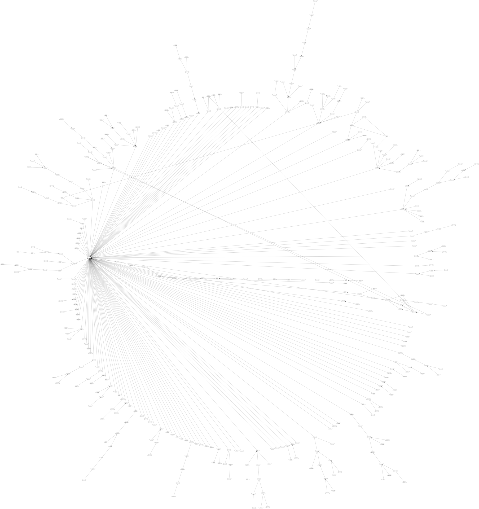
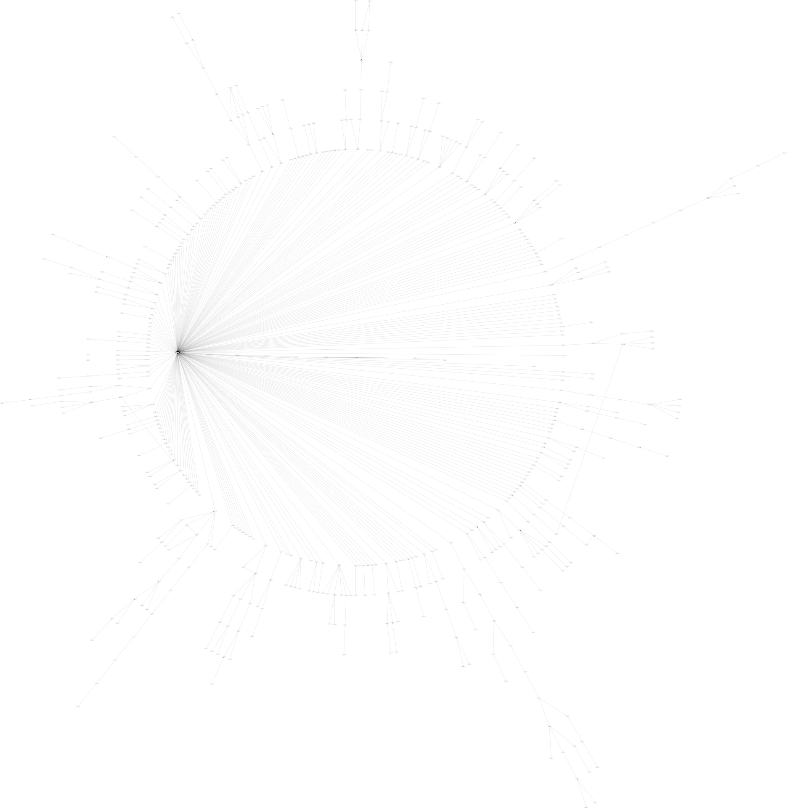
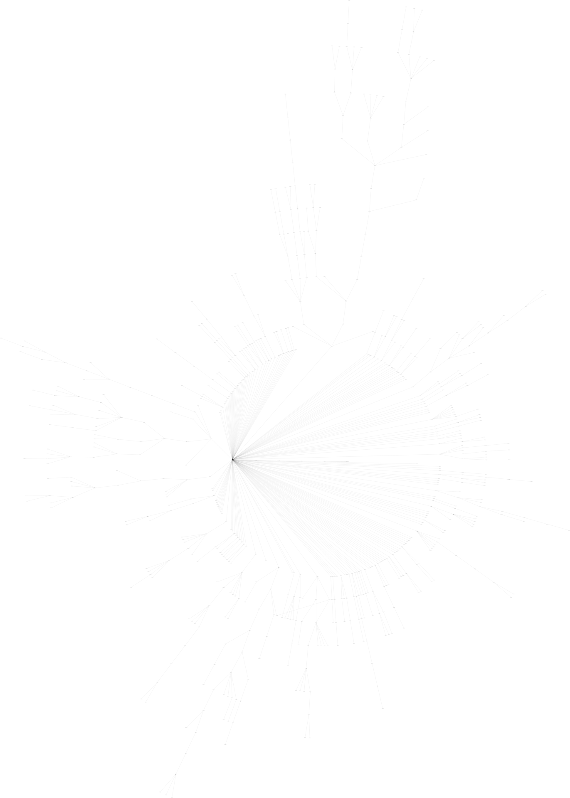

# Flashback tree

A graphical visualization tool for flashback threads using dot. 
Here, a node is represented by a post and an edge a quote.

## Usage

`./run.sh https://www.flashback.org/t12345678`

## Prerequisites

- node js
- npm
- twopi (dot)

## Installation

`npm install`

## Example outputs

<table>
  <tr>
    <td>
      
    </td>
    <td>
      
    </td>
  </tr>
  <tr>
    <td>
      
    </td>
    <td>
      
    </td>
  </tr>
  <tr>
    <td>
      
    </td>
    <td>
      
    </td>
  </tr>
</table>